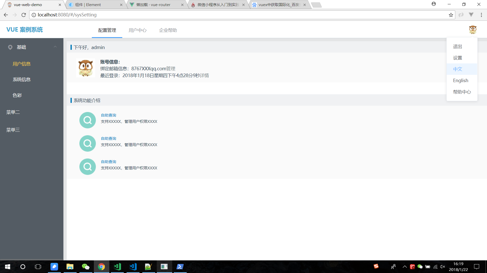
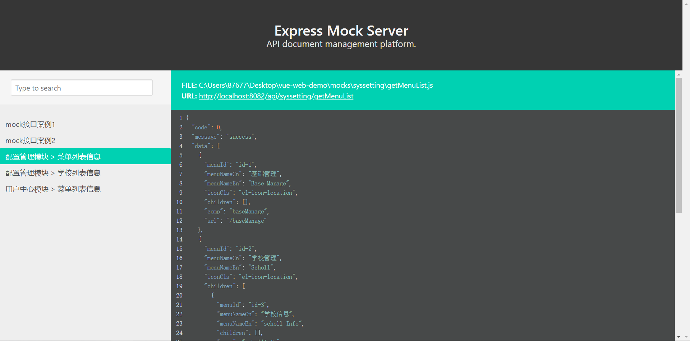

## vue-web-demo
vue 实现网页版前端框架搭建，只需在此基础上增加独立组件，便可很快速开发一个完善的后台管理系统。

## 主要功能
> 登录退出功能

> 国际化中英文界面切换

> 动态菜单列表

> 通过动态页签增减实现组件切换展示

> 路由切换菜单功能

> 通过mock + express 实现前后端分离

## 效果展示






## 技术栈
> [vue.js](https://cn.vuejs.org/) 构建用户界面的 MVVM 框架，核心思想是：数据驱动、组件系统。

> [vue-cli](https://www.npmjs.com/package/vue-cli) 是vue的脚手架工具，目录结构、本地调试、代码部署、热加载、单元测试。

> [vue-router](https://router.vuejs.org/zh-cn/) 是官方提供的路由器，使用vue.js构建单页面应用程序变得轻而易举。

> [vue-resource](https://www.npmjs.com/package/vue-resource) 请求数据，服务器通讯。

> [vuex](https://vuex.vuejs.org/zh-cn/) 是一个专为 vue.js 应用程序开发的状态管理模式，简单来说Vuex就是管理数据的。

> [Element](http://element-cn.eleme.io/#/zh-CN) 一套为开发者、设计师和产品经理准备的基于 Vue 2.0 的桌面端组件库

> [Vue-progressbar](http://hilongjw.github.io/vue-progressbar/) 进度条组件。

> [vue-i18n](https://kazupon.github.io/vue-i18n/) 国际化资源管理组件。

> [mock](http://mockjs.com/) mock是一个模拟数据生成器,旨在帮助前端独立于后端进行开发,帮助编写单元测试。

> [bk-sops](https://github.com/Tencent/bk-sops) bk-sops图形拖拽设计学习

> [jsPlumb](http://xiaoka2017.gitee.io/easy-flow/#) 照着这位大佬的项目学习的jsPlumb（非常感谢）

> A Vue.js project

## Build Setup

``` bash
# install dependencies
cnpm install

# 启动前端数据接口（前后端分离）at localhost:8082/api/
npm run mock

# serve with hot reload at localhost:8080
npm run dev


```

## 项目组织架构
>├─ .eslintrc.js
>├─ index.html
>├─ package.json // 配置文件
>├─ README.md // 说明文件
>├─ build // webpack打包执行文件
>├─ mock  // mock前后端分离实现的数据接口
>├─ config // webpack打包配置文件
>├─ code-standards //编码规范
>├─ src   
>│　　├─ main.js // webpack入口/项目启动入口
>│　　├─ api // 存放api接口文件，服务层
>│　　├─ common // 存放私有系统的公共样式、脚本、图片
>│　　│　　├─ css
>│　　│　　│　　└─ common.css // 公共样式
>│　　│　　├─ img // 公共图片
>│　　│　　├─ js
>│　　│　　│　　├─ common.js // 公共脚本
>│　　│　　│　　└─ utils.js // 工具类
>│　　├─ config
>│　　│　　├─ index.js // 共有配置文件
>│　　├─ router
>│　　│　　├─ index.js // 存放路由
>│　　├─ views // 视图
>│　　│　　├─ views.md
>│　　├─ vuex // 这一块将存放于common项目
>│　　│　　├─ index.js
>│　　│　　├─ actions
>│　　│　　├─ getters
>│　　│　　└─ modules

